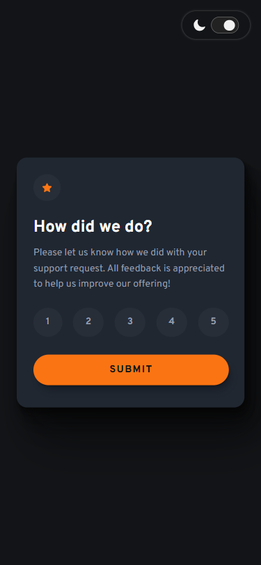
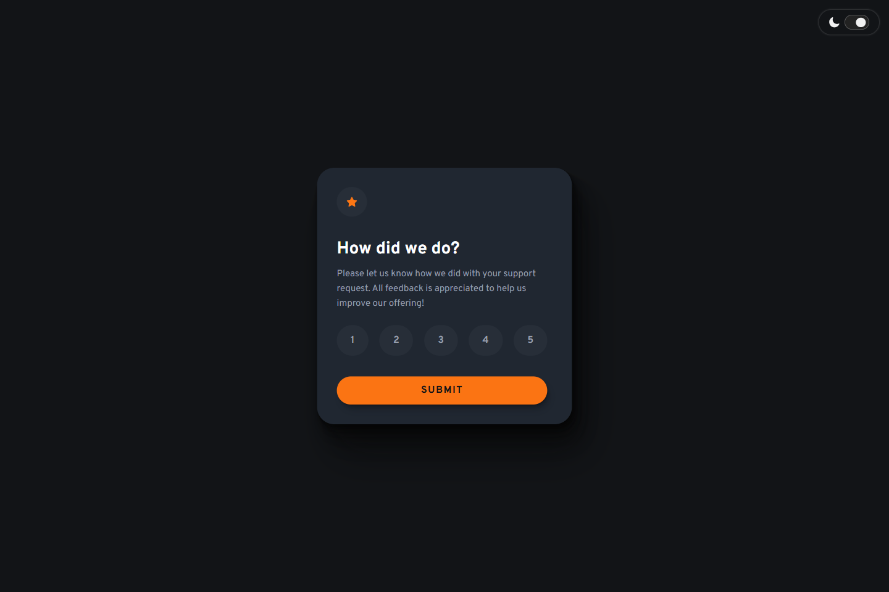
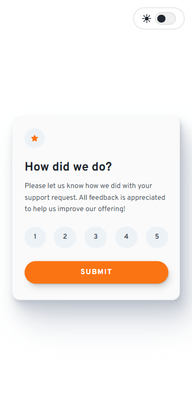
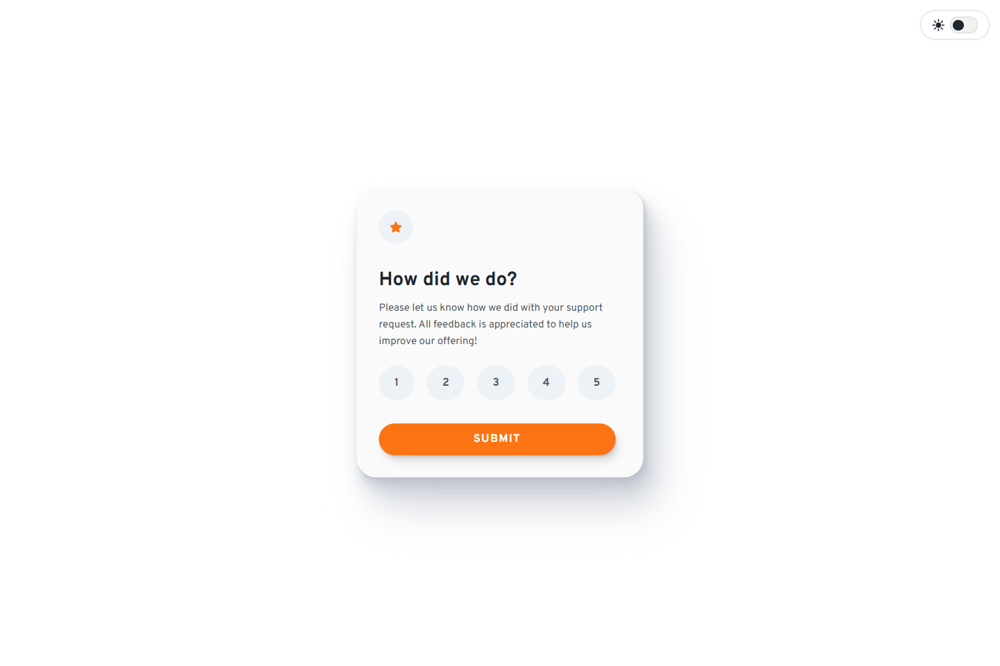

# 💻 Interactive Rating Component

## ℹ️ An Interactive Rating Component for a Fictional Support Service

| _Mobile Preview (375x812)_                                   | _Desktop Preview (1440x960)_                                    |
| ------------------------------------------------------------ | --------------------------------------------------------------- |
|  |  |
|       |       |

A responsive, accessible, and theme-toggle-enabled rating component where users can select a score from 1–5 and submit their feedback.

Created as part of the building challenges from [Frontend Mentor](https://www.frontendmentor.io/).

---

## 🔍 Overview

This project replicates a professional "rate your experience" card that adapts seamlessly between mobile and desktop layouts. The interface includes both light and dark mode themes, ensures smooth animations, and follows accessibility guidelines.

The component features custom focus states for keyboard navigation, hover interactions, and reduced-motion support for users who prefer minimal animation. Once a rating is submitted, a thank-you state is dynamically rendered with the selected score.

---

## ✨ Features

- Dark/light theme toggle using CSS variables
- Accessible with various dynamic ARIA attributes
- Mobile-first, fully responsive design
- Semantic HTML structure
- Focus styles for keyboard users
- Keyboard navigation for changing ratings
- Guarded code logic when submitting without selecting a rating
- Dynamic Confirmation Message on submission
- Reduced Motion Support based on `prefers-reduced-motion`
- [PerfectPixel](https://chrome.google.com/webstore/detail/perfectpixel-by-welldonecod/dkaagdgjmgdmbnecmcefdhjekcoceebi) alignment with design mockups

---

## 🧠 What I Learned

- Building accessible interactive components with semantic HTML
- Creating a functional keyboard navigation logic with `.focus()` and `.click()` methods
- Gained more experience in writing modular JavaScript for cleaner code organization
- Balancing UI feedback between clarity and non-intrusiveness wherein I used `alert()` in my previous code which is not good for UX
- I tried implementing more of the `animation` CSS property and using animation resets in JavaScript using `void element.offsetWidth`
- Complementing CSS animations with `addEventListener("animationend")` and `setTimeout()` for smooth transitions
- Guarding my site from spam clicks by disabling buttons and elements with `button.disabled = true` and `element.style.pointerEvents = "none"` and re-enabling them when an animation ends

---

## 🛠️ Tech Used

- HTML5
- CSS3
- JavaScript
- Git
- GitHub
- Netlify

---

## 🎨 Design Reference & Tools

- JPG design image
- PerfectPixel

---

## 🚀 How to Run

1. Clone the repository
2. Open `index.html` in your browser

---

## 🌐 Live Demo

Or you can check out the 👉 [live website here](https://interactive-rating-component-fcc-jiro.netlify.app/)

---

## 📊 Performance Report

A **Google Lighthouse** audit was conducted on the final version of this project. You can view the full report [here](./assets/downloads/lighthouse-performance-report.pdf).

---

## 🧑‍💻 Author

Created by **Elmar Chavez**

🗓️ Month/Year: **August 2025**

📚 Journey: **5th** month of learning _frontend web development_.
